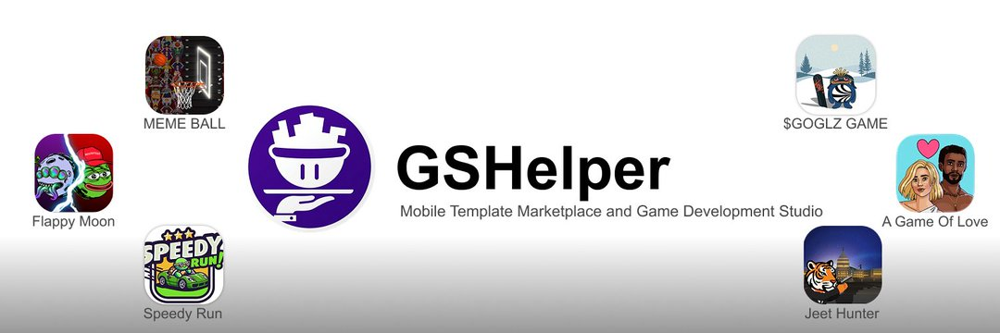

  

 

  

---

### 👨‍💻 About Me

I am a **Professional Software Developer** specializing in video game creation, web platforms, and mobile applications. Currently, I'm proud to be part of the development team at **[gshelper.com](https://gshelper.com)**, collaborating to take ideas to the next level while actively managing my own interactive projects.

I am passionate about integrating emerging technologies into my work. I leverage the full power of **Artificial Intelligence** tools to streamline code generation and deeply explore the **Web3** ecosystem, always maintaining a strong focus on **UI/UX** design to craft polished and immersive experiences.

---

### 🛠️ Tech Stack & Tools

  
  
  
  
  
    
  
  
  
  
  
  

---

### 🚀 What I'm currently building

| Project | Description | Focus |
| :--- | :--- | :--- |
| 🏂 **Snowpenguinsurf** | Skiing and snowboarding game focused on fluid physics and mechanics. | `Game Dev` `Physics` |
| 👾 **Web3 Development** | NFT integration and UI improvements for `moonsters` and `balltoken`. | `Solana` `Smart Contracts` |
| 🎮 **Central Ecosystem** | Unified web platform to centralize my game repositories. | `Web Architecture` `UI/UX` |

---

### 📈 My GitHub Stats

  

---

 

  <i>Always open to discussing game development, blockchain integrations, AI, or UI/UX design!</i>

